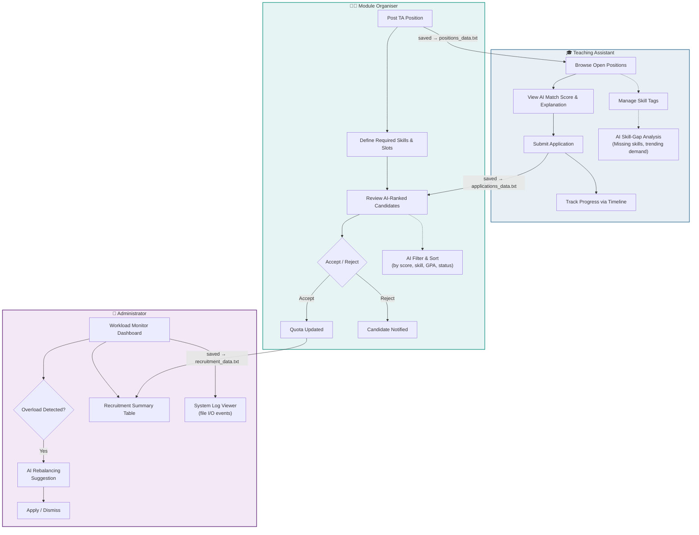
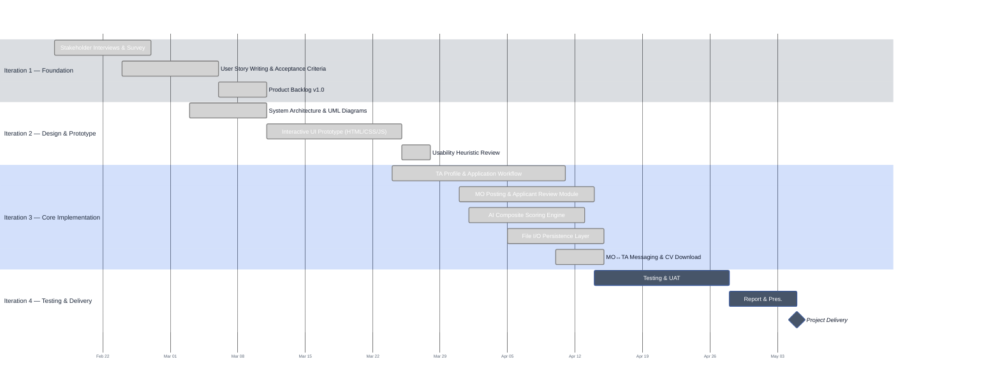

<div align="center">

# Smart-TA: AI-Powered Recruitment for BUPT

**Streamlining Teaching Assistant recruitment with intelligent matching, role-based workflows, and file-based JSON persistence (no SQL database).**

[](#)
[](#)
[](#)
[](#-technical-stack)
[](#)
[](#)
[](#)

<br/>

> _"Replacing scattered emails and opaque selection with a single, intelligent platform."_

</div>

---

## Table of Contents

- [Project Overview](#-project-overview)
- [Key Features](#-key-features)
- [System Architecture](#-system-architecture)
- [Technical Stack](#-technical-stack)
- [Quick Start](#-quick-start)
- [Prototype Walkthrough](#-prototype-walkthrough)
- [Roadmap & Agile Process](#-roadmap--agile-process)
- [Repository Structure](#-repository-structure)
- [Team](#-team)
- [License](#-license)

---

## 📖 Project Overview

Traditional Teaching Assistant (TA) recruitment at BUPT suffers from fragmented communication, manual spreadsheet tracking, and a lack of transparency for all stakeholders. **Smart-TA** is a full-stack system design project that reimagines this process through three core principles:

| Principle | Description |
|-----------|-------------|
| **Role-Based Clarity** | Dedicated dashboards for TAs, Module Organisers (MOs), and Administrators — each seeing only what they need. |
| **AI-Assisted Decision-Making** | Composite matching scores that rank candidates by skill overlap, GPA relevance, and workload availability. |
| **Zero-Database Persistence** | All data is stored as JSON files under `webapps/SmartTA/data/` via `JsonFileStore`. No SQL or NoSQL database; all persistence is real and immediate — not simulated. |

This repository contains the complete deliverables for **EBU6304 Software Engineering (2025–26 Spring)**, from requirements engineering and Agile backlog planning through interactive prototyping and system architecture design.

---

## ✨ Key Features

### 🎯 Intelligent Candidate Matching

Every applicant receives an **AI composite score** (0–100) computed from:
- **Skill Overlap** — percentage of required skills the candidate possesses
- **GPA Relevance** — weighted comparison against module-specific thresholds
- **Availability** — remaining weekly hours vs. the position requirement

Module Organisers can hover over any candidate's score to view a full **AI Explanation Tooltip**, ensuring the matching process is transparent and explainable.

### 📊 Real-Time Workload Monitoring

Administrators have a global **Workload Distribution Panel** that visualises every TA's committed hours against the 20-hour institutional cap. When a TA exceeds the limit, the system:
1. Flags the overload with a visual warning (red bar + OVERLOAD label)
2. Triggers an **AI Rebalancing Recommendation** via DeepSeek LLM — "Apply Suggestion" reduces the overloaded TA's hours via `POST /api/rebalance`
3. Falls back to a fixed 4-hour reduction rule if the AI service is unavailable
4. Logs the event to `system_logs.json`

### 💬 MO ↔ TA In-System Messaging

A bidirectional message channel enables direct communication between Module Organisers and their recruited TAs:
- **TA Side**: "My Positions" shows accepted offers; clicking an MO opens the message thread
- **MO Side**: "My TAs" lists recruited assistants; unread badge on the Messages tab
- Messages are persisted to `mo_ta_messages.json` and support marking as read

### 📄 CV Management

TAs can upload their CV once and MO/Admin can download it:
- **TA**: Upload CV (PDF/DOC/DOCX) via `UploadServlet` → stored in `cv_uploads/`
- **MO**: Download from applicant profile in the "My TAs" or applicant review panel
- **Admin**: Access via applicant management panel

### 🔐 Role-Based Access Control

Multi-role user accounts with fine-grained permission control:
- **TA**: Browse positions, apply, manage profile, view accepted positions, send/receive messages
- **MO**: Post modules, review applicants, accept/reject, download TA CVs, send/receive messages
- **Admin**: Full system access — workload management, user management, applicant management, logs

### 🗂 Zero-Database JSON Persistence

All data is stored as JSON files under `webapps/SmartTA/data/` via `JsonFileStore`. On first startup, seed data is generated for positions, applicants, users, and applications. The Admin panel includes:
- A **System Activity Log** viewer showing timestamped read/write events
- A **File Storage Status** dashboard reporting the health of each JSON data file

---

## 🏗 System Architecture

The following diagram illustrates the end-to-end recruitment workflow across all three user roles:



---

## 🛠 Technical Stack

| Layer | Technology | Notes |
|-------|-----------|-------|
| **Frontend** | HTML5, CSS3 (Custom Properties), Vanilla JavaScript | JSP-based role dashboards; live API calls to backend |
| **Backend** | Java 17, Jakarta Servlet 6.0, Apache Tomcat 10.1 | REST API via ApiServlet; session-based auth with role switching |
| **Persistence** | JSON flat-files via JsonFileStore | Runtime data at webapps/SmartTA/data/; no SQL or NoSQL DB |
| **AI Engine** | Composite scoring engine + DeepSeek LLM API | Weighted formula: 0.4 Skill + 0.3 GPA + 0.3 Availability; AI match analysis and workload rebalancing |
| **Design System** | CSS Custom Properties (Design Tokens) | 20+ tokens for colours, spacing, shadows, and typography |
| **Typography** | Google Fonts (DM Sans, Playfair Display) | Loaded via CDN for consistent cross-browser rendering |
| **Testing** | JUnit 5, Mockito, AssertJ, JaCoCo | 162 unit tests with coverage reports |
| **Build** | Maven | Dependency management and build automation |
| **Methodology** | Agile Scrum (4 iterations) | Product Backlog managed in structured format |

### Backend stack (`SmartTA/`)

The deployable web application runs on **Apache Tomcat 10.1+** with **Jakarta EE 10** (`jakarta.servlet.*`, Servlet 6.0 / `web-app` 6.0). Main backend pieces:

| Component | Technology | Role |
|-----------|------------|------|
| **Runtime** | Apache Tomcat 10.x | Servlet container; exploded WAR under `webapps/SmartTA/` |
| **Language** | Java 17 | Business logic, models, JSON API |
| **Views** | JSP (`index.jsp`, `ta.jsp`, `mo.jsp`, `admin.jsp`, `error.jsp`) | Role-based dashboards; client-side JS calls REST endpoints |
| **REST API** | `ApiServlet` → `/api/*` | JSON over HTTP: positions, applicants, applications, logs, workloads, scoring, apply/update flows |
| **Authentication** | `AuthServlet` → `/auth/*` | Session-based login, logout, role switching |
| **Serialization** | Jackson (databind) | Read/write JSON for persistence and API responses |
| **Data access** | `DataStore` + `JsonFileStore` | Singleton in-memory cache with flush to `data/*.json` |
| **AI Integration** | `LLMService` + DeepSeek API | AI match analysis, workload rebalancing recommendations |
| **Security** | `SecurityHeadersFilter` | HTTP security headers (XSS, clickjacking protection) |
| **Config** | `WEB-INF/web.xml` | Servlet mappings, welcome file, error pages |

> **No SQL/NoDB:** The system stores all data as JSON files via `JsonFileStore` under `webapps/SmartTA/data/`. This satisfies the EBU6304 No-DB constraint while providing real persistence — not a simulation. Each write operation (position creation, application submission, profile update) is immediately flushed to disk and reflected in subsequent reads.

---

## 🚀 Quick Start

### Option A — Prototype (No Server)

```bash
# 1. Clone the repository
git clone https://github.com/your-org/EBU6304-Group-37.git

# 2. Open the prototype in your default browser
start Prototype_group37.html
```

Runs client-side in any modern browser. No build tooling required.

### Option B — Full Application (Tomcat Backend)

#### Option 1: Maven Build (Recommended)

```bash
# 1. Navigate to SmartTA directory
cd SmartTA

# 2. Run unit tests (optional)
mvn test

# 3. Deploy to Tomcat
cp target/smartta-3.0.jar D:\Tomcat\apache-tomcat-10.1.48\webapps\SmartTA\

# 4. Restart Tomcat and open in browser
# http://localhost:8080/SmartTA/
```

#### Option 2: Manual Deployment

```bash
# 1. Copy SmartTA/ into Tomcat webapps
cp -r SmartTA D:\Tomcat\apache-tomcat-10.1.48\webapps\

# 2. Compile the Java backend
cd SmartTA
javac -encoding UTF-8 -cp "D:\Tomcat\apache-tomcat-10.1.48\lib\*" -d WEB-INF/classes `
    src/main/java/com/bupt/smartta/model/*.java
    src/main/java/com/bupt/smartta/servlet/*.java
    src/main/java/com/bupt/smartta/util/*.java
    src/main/java/com/bupt/smartta/filter/*.java
    src/main/java/com/bupt/smartta/listener/*.java

# 3. Restart Tomcat and open in browser
# http://localhost:8080/SmartTA/
```

#### Demo Accounts

| Username | Password | Role |
|---------|----------|------|
| `admin` | `admin123` | Administrator |
| `mosmith` | `mo123` | Module Organiser |
| `zhangwei` | `ta123` | Teaching Assistant |
| `limei` | `ta123` | Teaching Assistant |

---

## 🖥 Prototype Walkthrough

The interactive prototype covers three role-based dashboards, each accessible via the top navigation bar:

### TA Dashboard

| Feature | Description |
|---------|-------------|
| **Available Positions** | Filterable job listing with AI match scores and hover-to-explain tooltips |
| **My Applications** | Visual timeline tracker showing each application's progress (Submitted → Review → Interview → Decision) |
| **Skill Management** | Add/remove skill tags interactively; changes trigger simulated file-save feedback |
| **AI Skill-Gap Analysis** | Sidebar panel highlighting missing skills and trending demand this semester |

### MO Portal

| Feature | Description |
|---------|-------------|
| **Post Position** | Complete form with skill input, hour selection, slot count, and deadline — publishes with animated save bar |
| **Review Applicants** | AI-ranked candidate table with composite score breakdown, filterable by score/status/skill |
| **Manage Quotas** | Visual slot management cards with +/- controls and fill-progress indicators |

### Admin Overview

| Feature | Description |
|---------|-------------|
| **Workload Monitor** | Horizontal bar chart of every TA's hours with colour-coded overload warnings |
| **Recruitment Summary** | Module-level table showing applicants, acceptances, and remaining slots |
| **System Logs** | Terminal-styled log viewer with INFO/WARN/ERROR entries referencing file I/O operations |
| **File Storage Status** | Grid showing health status of all simulated data files |

---

## 🗺 Roadmap & Agile Process

Development follows a four-iteration Agile Scrum cycle. Each iteration delivers a shippable increment. Sprint planning prioritises core functions first — working software is delivered in every iteration, not only at the end.

### Smart-TA Development Roadmap

### Smart-TA Development Roadmap



### Iteration Highlights

| Iteration | Focus | Key Deliverables |
|-----------|-------|-----------------|
| **1** | Foundation | Stakeholder interviews (3 MOs, 5 TAs), survey results, 18 user stories with MoSCoW priorities, acceptance criteria, Product Backlog v1.0 |
| **2** | Design | System architecture diagram, UML class/sequence diagrams, interactive HTML prototype with 3 role-based dashboards |
| **3** | Implementation | TA profile + job application workflow, MO posting + applicant review, AI scoring engine, file I/O persistence, MO↔TA messaging, CV download, DeepSeek LLM integration, 162 JUnit tests |
| **4** | Delivery | JUnit integration tests, UAT scenarios, final report, demonstration video |

---

## 🔗 Traceability Matrix

Each prototype feature is directly traceable to a user story in the backlog, which was elicited through a specific fact-finding technique. This ensures every implemented function has a documented rationale.

| Fact-Finding Finding | User Story | Prototype Feature |
|----------------------|------------|-------------------|
| **Interview (MO)**: MOs spend 3+ hours manually matching applicants | "As an MO, I want to see AI-ranked candidates so I can make faster, fairer decisions" | MO Portal → AI-ranked applicant table with composite scores |
| **Interview (TA)**: TAs have no visibility into application status after submission | "As a TA, I want to track my application status in real time" | TA Dashboard → Application timeline tracker |
| **Survey (TAs)**: 80% of TAs report difficulty identifying in-demand skills | "As a TA, I want to see skill-gap analysis so I can improve my profile" | TA Dashboard → AI Skill-Gap Analysis sidebar |
| **Observation (Admin)**: Workload monitoring relies on spreadsheets and emails | "As an Admin, I want a centralised workload dashboard" | Admin Portal → Workload Distribution Panel |
| **Survey (MO)**: MOs need to define required skills per position for matching | "As an MO, I want to post positions with required skills" | MO Portal → Post Position form with skill input |
| **Interview (Admin)**: No centralised log of file I/O operations exists | "As an Admin, I want to view system activity logs" | Admin Portal → System Log Viewer |
| **Survey (TAs)**: TAs apply via scattered emails; CVs are stored inconsistently | "As a TA, I want to upload my CV once and apply to multiple positions" | TA Dashboard → Upload CV + profile persistence |
| **Interview (MO)**: Quota over-allocation occurs when multiple MOs accept the same TA | "As an MO, I want to see real-time quota availability" | MO Portal → Manage Quotas with fill-progress indicators |

---

## 📈 Feedback Response (First Assessment)

Based on the first-assessment feedback, the following improvements have been made:

- **Sprint planning tightened**: Each sprint now has specific, realistic deliverables (e.g., not "Core Module Development" but broken into "TA Profile & Application Workflow", "MO Posting Module", etc.) with estimated effort in person-days.
- **Traceability strengthened**: A traceability matrix has been added above, directly linking each fact-finding finding to its user story and corresponding prototype feature.
- **Workload more balanced**: Iteration 3 tasks are scoped to avoid over-commitment; parallel tracks allow sub-team work without blocking each other.

---

## 📂 Repository Structure

```text
EBU6304-Group-37/
├── Prototype_group37.html       # Interactive UI prototype (standalone, no backend)
├── EBU6304_GroupProjectHandout.pdf  # Project handout
├── README.md                   # Project overview (you are here)
└── SmartTA/                   # Tomcat Servlet/JSP backend (v3.0)
    ├── pom.xml                 # Maven build configuration (JUnit 5, JaCoCo)
    ├── src/main/java/com/bupt/smartta/
    │   ├── model/              # TAPplicant, Position, Application, SystemLog, MoTaMessage, User, SystemConfig
    │   ├── servlet/            # ApiServlet, AuthServlet, UploadServlet, DownloadServlet (REST API)
    │   ├── util/               # DataStore singleton, JsonFileStore, LLMService
    │   ├── filter/             # SecurityHeadersFilter (XSS/clickjacking protection)
    │   └── listener/           # AppContextListener (system initialization)
    ├── src/test/java/          # JUnit 5 unit tests (162 tests passing)
    ├── src/test/resources/     # Test data (JSON fixtures)
    ├── WebContent/
    │   ├── index.jsp           # Role-selection landing page
    │   ├── ta.jsp              # TA Dashboard (profile, apply, my positions, messages)
    │   ├── mo.jsp              # MO Portal (post, review, accept/reject, my TAs, messages)
    │   ├── admin.jsp           # Admin Overview (workload, logs, user/applicant management)
    │   └── WEB-INF/web.xml     # Servlet configuration
    ├── data/                   # JSON persistence (created at runtime)
    │   ├── users.json          # User accounts
    │   ├── applicants.json     # TA applicant profiles
    │   ├── positions.json      # Course/position listings
    │   ├── applications.json   # Application records
    │   ├── workloads.json      # TA workload hours
    │   ├── system_logs.json    # File I/O activity log
    │   ├── mo_ta_messages.json # MO↔TA message history
    │   └── system_config.json  # System configuration & version info
    └── cv_uploads/             # Uploaded CV files (PDF/DOC/DOCX)
```

> **v3.0 Final Assessment:** The `SmartTA/` directory contains the fully functional Java Servlet/JSP application. Run `mvn test` in the `SmartTA/` directory to execute the automated test suite. See `SmartTA/` for deployment instructions. The original `Prototype_group37.html` remains available as the standalone visual prototype.

---

## 👥 Team

**Group 37** — EBU6304 Software Engineering, BUPT, Spring 2025–26

| Role | Responsibility |
|------|---------------|
| Product Owner | Requirements elicitation, backlog prioritisation |
| Scrum Master | Sprint planning, stand-ups, retrospectives |
| UI/UX Designer | Prototype design, usability heuristic evaluation |
| System Architect | UML modelling, component design, data flow |
| QA Engineer | Test planning, acceptance criteria verification |

---

## 📄 License

This project is licensed under the **MIT License** — see the [LICENSE](LICENSE) file for details.

---

<div align="center">

_Built with rigour and care for EBU6304 · Beijing University of Posts and Telecommunications_

**[⬆ Back to Top](#smart-ta-ai-powered-recruitment-for-bupt)**

</div>
