# Smart-TA — User Manual

**Version:** 3.0
**Group:** EBU6304 — Group 37
**Last Updated:** May 2026

---

## Table of Contents

1. [Introduction](#1-introduction)
2. [Getting Started](#2-getting-started)
3. [Teaching Assistant (TA) Portal](#3-teaching-assistant-ta-portal)
4. [Module Organiser (MO) Portal](#4-module-organiser-mo-portal)
5. [Administrator Portal](#5-administrator-portal)
6. [FAQ](#6-faq)

---

## 1. Introduction

Smart-TA is a web-based TA recruitment and management system developed for BUPT International School. It serves three user roles:

| Role | Description |
|---|---|
| **Teaching Assistant (TA)** | Students who browse open positions and submit applications |
| **Module Organiser (MO)** | Instructors who post TA positions and manage applicants |
| **Administrator (ADMIN)** | System administrators who manage users and monitor workloads |

---

## 2. Getting Started

### 2.1 Accessing the Application

Open your browser and navigate to:

```
http://localhost:8081/SmartTA/
```

> The default port is **8081**. Your administrator may have configured a different port.

### 2.2 Login

On the login page, enter your **Username** and **Password**, then click **Sign In**.

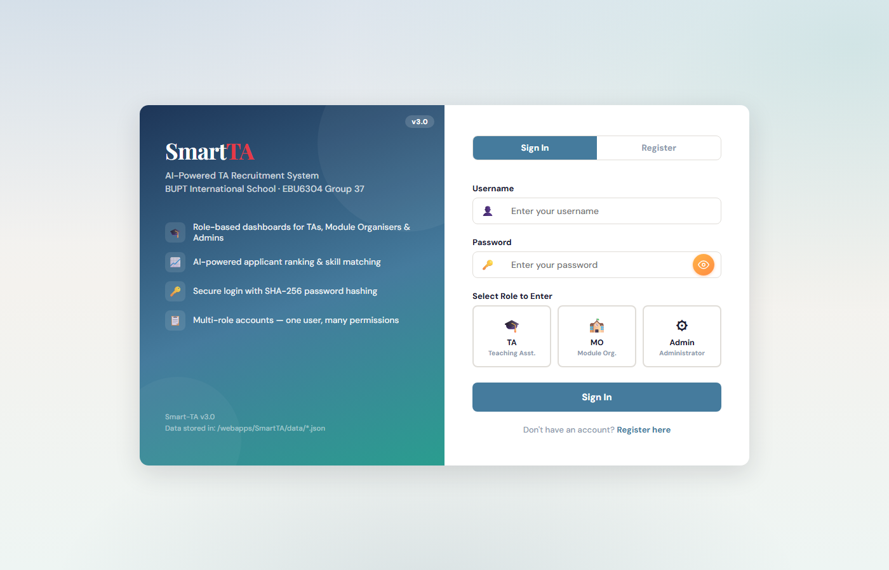
**Figure 1: Login Page**

If you do not have an account, click **"No account yet? Register here"** to create one.

### 2.3 Register a New Account

Click the registration link on the login page.

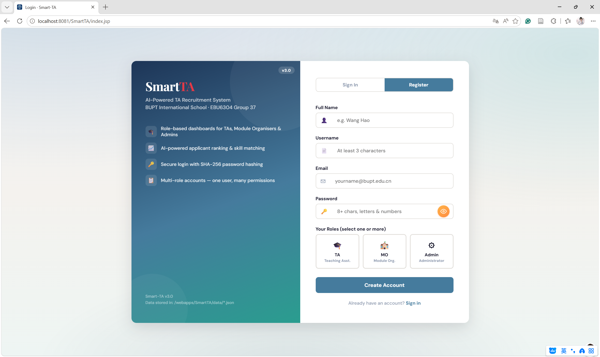
**Figure 2: Registration Page**

Fill in all fields:
- **Username** — 3–30 characters, letters, numbers, and underscores only
- **Display Name** — your name as it will appear to MOs and administrators
- **Email** — a valid email address
- **Password** — at least 8 characters, must contain both letters and numbers
- **Role** — select one role (or multiple):
  - **TA (Teaching Assistant)** — apply for and hold TA positions
  - **MO (Module Organiser)** — post positions and review applicants
  - **ADMIN (Administrator)** — manage the system

Click **Register** to create your account and log in automatically.

---

## 3. Teaching Assistant (TA) Portal

### 3.1 Available Positions

Browse all open TA positions on the Available Positions page.

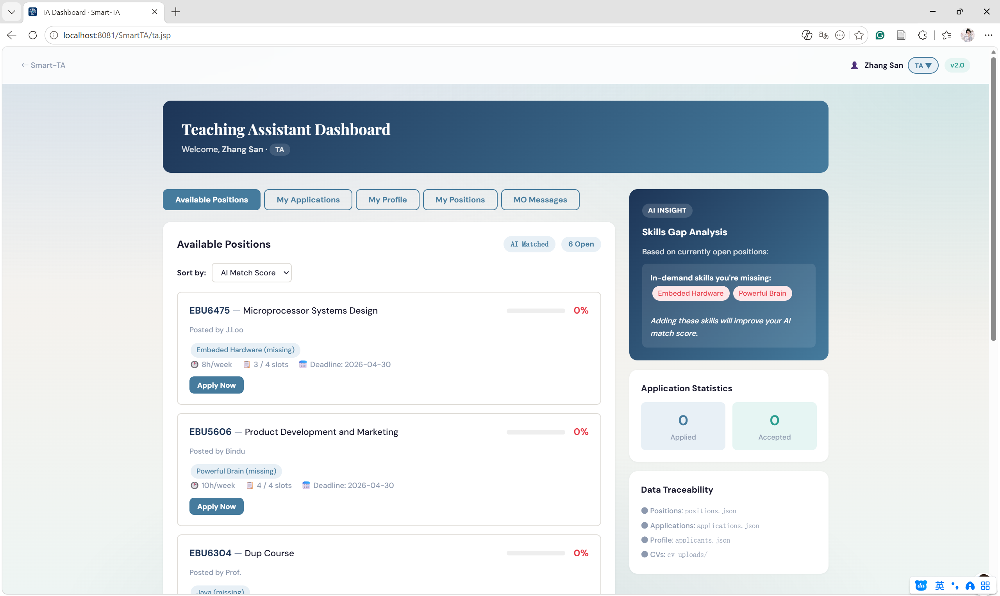
**Figure 3: TA Available Positions**

For each position you will see:
- **Position name** (e.g., "Network Security") and its **course code** (e.g., CST302)
- **TA Count** — how many TAs are already assigned
- **Hours/Week** — expected weekly hours
- **Slots** — total and remaining positions available
- **Deadline** — application closing date

Click **Apply** to submit your application. Your AI match score will be computed based on your profile and displayed immediately.

> Positions you have already applied for (regardless of status) will not appear in this list.

---

### 3.2 My Applications

Track all your submitted applications on the My Applications page.

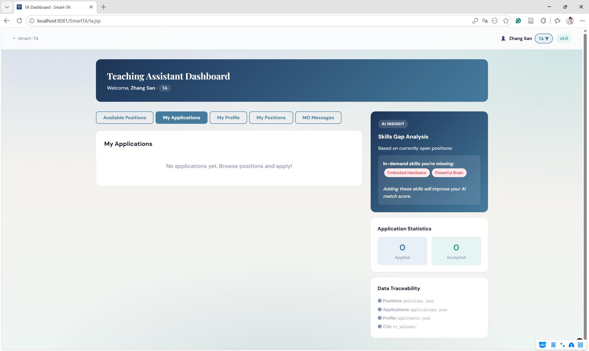
**Figure 4: TA My Applications**

The application table shows:
- **Applied Date** — when you submitted the application
- **AI Score** — your composite match score for this position
- **Status** — current state of your application

Application statuses:

| Status | Description |
|---|---|
| **Submitted** | Application received, awaiting MO review |
| **Under Review** | MO is actively reviewing your application |
| **Accepted** | MO hired you — you are now a TA for this position |
| **Rejected** | MO declined your application |

If rejected once, the position becomes available again after you view the details. If rejected twice, you are permanently blocked from that position.

---

### 3.3 My Profile

Manage your TA profile to improve your AI match scores.

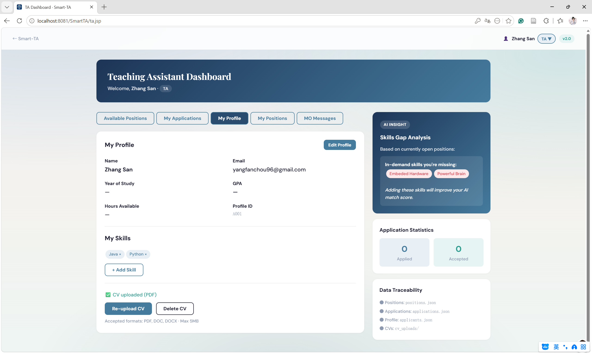
**Figure 5: TA My Profile**

**Personal Information:**
- Edit your **Display Name** and **Email**
- Set your **Year of Study**
- Enter your **GPA** (out of 4.0)

**Skills:**
- Click on skill tags to select from predefined suggestions (Java, Python, JavaScript, etc.)
- Your matched skills contribute **40%** of your AI score

**Availability:**
- Set your **Available Hours per Week** for TA work
- This contributes **30%** of your AI score

**CV Upload:**
- Accepted formats: **PDF**, **DOC**, **DOCX** (max 5 MB)
- Click **Choose File** to select your CV
- Click **Upload** to save it
- Only one CV is stored at a time — uploading a new file replaces the old one

Click **Save Profile** to store all changes.

> Your **GPA** contributes **30%** and **Availability** contributes **30%** of your AI composite score. Keep your profile up to date to improve your match scores.

---

### 3.4 My Positions

After your application is **Accepted**, the position will appear under **My Positions**.

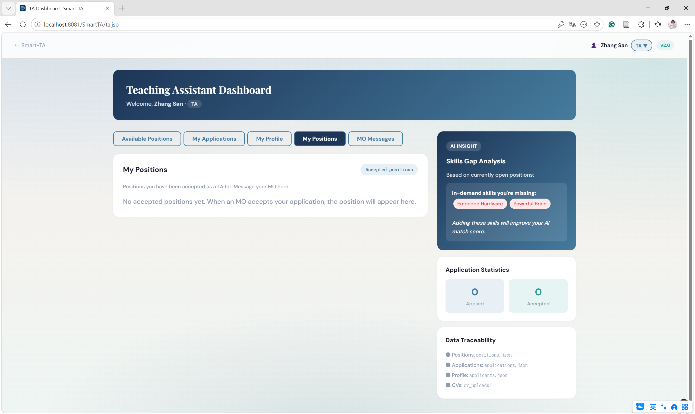
**Figure 6: TA My Positions**

This page shows all positions for which you have been accepted as a TA. Currently there are no accepted positions in this example.

---

### 3.5 MO Messages

Communicate directly with your assigned Module Organiser(s) through the MO Messages feature.

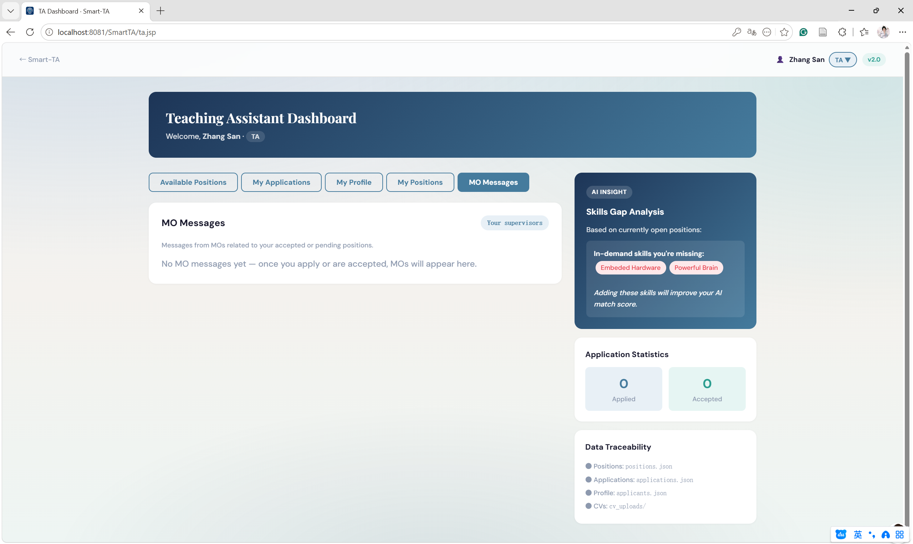
**Figure 7: TA MO Messages**

Each message card shows:
- The **position name** you are communicating about
- The **MO's name**
- Your sent messages and the MO's replies
- The **status** of the associated application

Type your message in the input field and click **Send** to communicate with the MO.

---

## 4. Module Organiser (MO) Portal

### 4.1 My Modules

The My Modules page shows an overview of all positions you have posted.

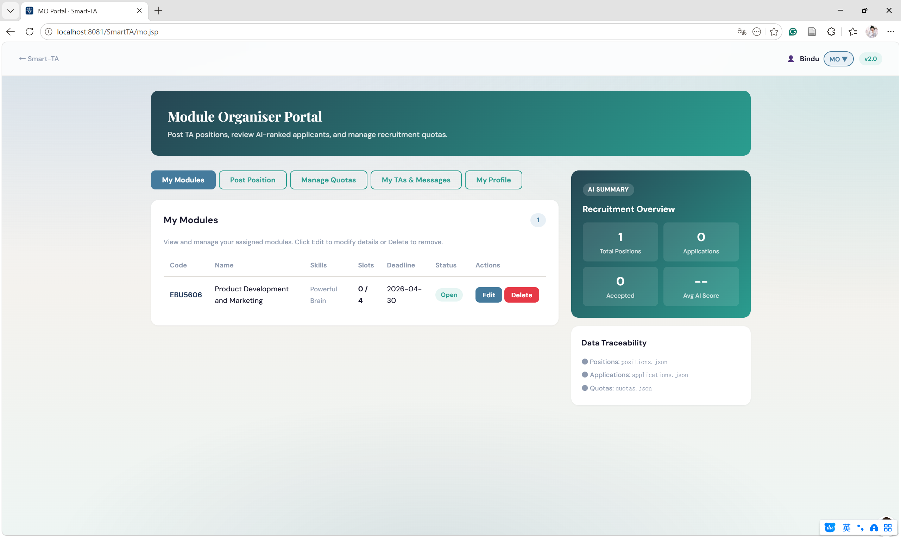
**Figure 8: MO My Modules**

For each posted position you can see:
- **Course Code** and **Position Name**
- **TA Count** — number of TAs currently assigned
- **Hours/Week** — weekly hours required
- **Slots** — total and filled/remaining slots
- **Deadline** — application closing date
- **Status** — current status (Open, Closed, etc.)

From this page you can navigate to:
- **Applicants** — review and manage TA applications for each position
- **Post New Position** — create a new TA position
- **Manage Quotas** — update TA workload hours and capacity
- **My TAs & Messages** — view accepted TAs and send messages

---

### 4.2 Post New Position

Create a new TA position by filling in the Post Position form.

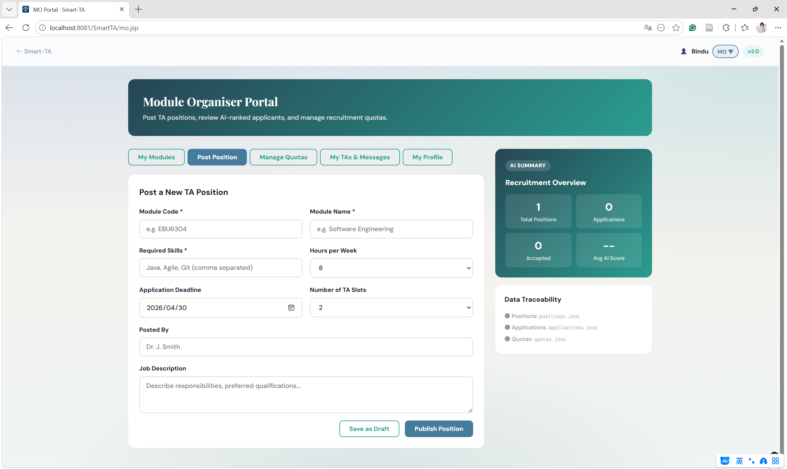
**Figure 9: MO Post Positions**

Fill in all required fields:
- **Position Code** — a unique identifier (e.g., `CST302`)
- **Position Name** — the full course name
- **Required Skills** — click tags to select from the suggestions, or type custom skills
- **Hours per Week** — expected weekly hours of work
- **Slots** — total number of TA positions to fill
- **Deadline** — application closing date (select from the date picker)

Click **Post Position** to publish the position. It will immediately appear in the TA Available Positions list.

---

### 4.3 Manage Quotas

Monitor and adjust TA workload allocations from the Manage Quotas page.

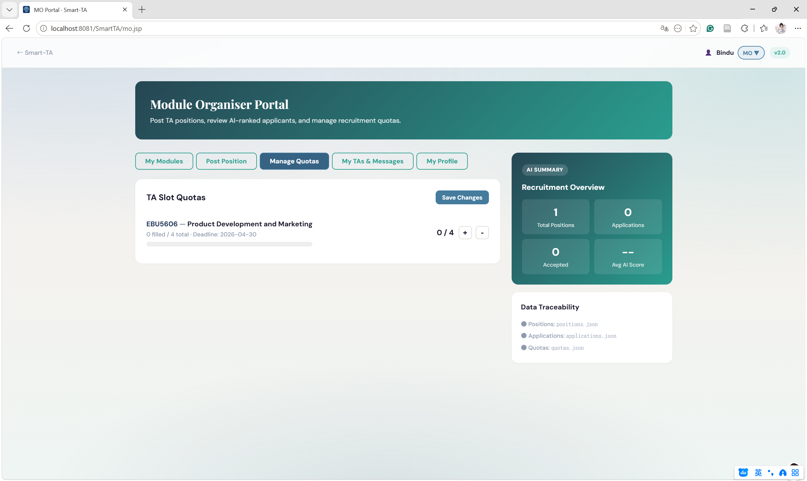
**Figure 10: MO Manage Quotas**

The page displays:
- Each accepted TA and their assigned course
- **Current Hours** — the TA's current weekly workload
- **Capacity** — the maximum safe weekly hours (20 h/week)
- **Status** — whether the TA is within safe limits or overloaded (marked in red)

Click the **Update Quota** button to adjust a TA's allocated hours. Reducing a TA's hours will free capacity for other TAs.

---

### 4.4 My TAs & Messages

View your accepted TAs and communicate with them from a single page.

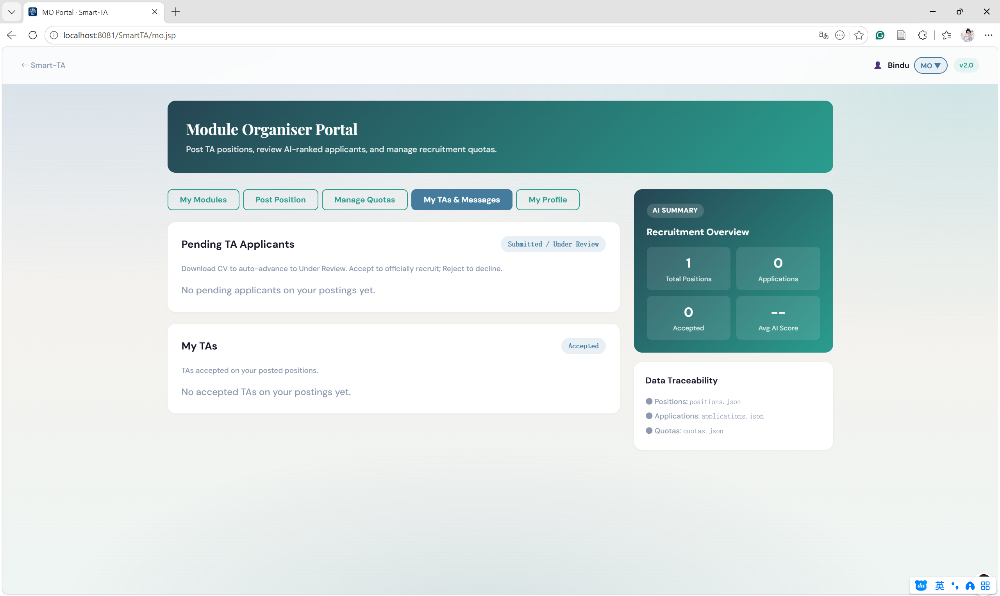
**Figure 11: MO My TAs & Messages**

For each accepted TA you will see:
- **TA Name** and **Email**
- **Course** — the position they are assigned to
- **Current Hours** — their current workload

Use the **message input field** at the bottom to send a message to the selected TA. All communication is stored and visible in the TA's MO Messages page.

---

### 4.5 My Profile

Update your own MO profile information, including your display name and email address.

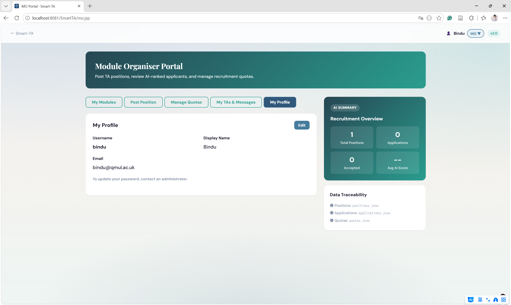
**Figure 12: MO My Profile**

---

## 5. Administrator Portal

### 5.1 Admin Dashboard

The Admin Dashboard provides system-wide oversight through a tabbed interface.

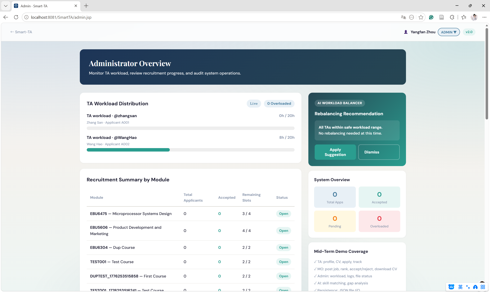
**Figure 13: Admin Dashboard**

The tabs available are:
- **System Logs** — view audit logs of all data operations
- **Data Traceability** — view the status and paths of all data files
- **Applicant Management** — browse and manage all TA applicant records
- **User Management** — view, create, and delete user accounts

---

### 5.2 System Logs

Click the **System Logs** tab to view a chronological record of all data operations, including:
- Read, write, and error events on each JSON data file
- Timestamps and operation results

---

### 5.3 Data Traceability

Click the **Data Traceability** tab to view:
- All data files and their storage paths
- File sizes and categories
- Last-modified timestamps

---

### 5.4 Applicant Management

Click the **Applicant Management** tab to browse all registered TA applicants. From here administrators can:
- View applicant profiles
- View their submitted applications and statuses
- Delete applicant records if needed

---

### 5.5 User Management

Click the **User Management** tab to manage user accounts. Administrators can:
- View all registered users and their assigned roles
- Create new user accounts
- Delete existing user accounts

> You cannot delete your own account, and you cannot delete the last remaining ADMIN account.

---

## 6. FAQ

### How do I log in?
Enter your username and password on the login page (Figure 1) and click **Sign In**.

### How do I register?
Click **"No account yet? Register here"** on the login page, fill in all fields, select your role, and click **Register** (Figure 2).

### How does the AI score work?
The AI composite score (0–100) is calculated from:
- **Skill Match (40%)** — how many of the position's required skills you have
- **GPA (30%)** — your GPA normalised to a 4.0 scale
- **Availability (30%)** — your available hours per week normalised to 20 h/week

Keep your profile complete and up-to-date to improve your scores.

### I was rejected — can I apply again?
- **First rejection:** Yes — the position becomes available again after you view the rejection details.
- **Second rejection for the same position:** No — you are permanently blocked from that position.

### Can I apply for the same position twice?
Yes, after the first rejection (before the second). The system tracks how many times you have applied.

### How do I upload my CV?
Go to **My Profile** → scroll to the **CV Upload** section → click **Choose File** → select your PDF/DOC/DOCX file (max 5 MB) → click **Upload**.

### How do I message my MO?
Go to **MO Messages** (TA) → select the position → type your message → click **Send**.

### How do I message my TAs as an MO?
Go to **My TAs & Messages** → select a TA from the list → type your message → click **Send**.

### The LLM analysis shows a template message — what does this mean?
The Bailian (Qwen) API is not available. This happens when the `DASHSCOPE_API_KEY` is not configured or the server has no internet access. The system falls back to a template-based explanation and still functions normally.

### How do I configure the LLM API key?
Add `DASHSCOPE_API_KEY=your_key_here` to the `.env` file in the SmartTA directory, or set the `DASHSCOPE_API_KEY` environment variable before starting Tomcat.

### How do I change my password?
Contact your system administrator to update your password.

### How do I reset my data?
Your data is stored in the `data/` directory as JSON files. Administrators can view and manage data files from the **Data Traceability** tab in the Admin Portal.

### How do I log out?
Click the **Sign Out** button in the navigation bar. This will end your session and return you to the login page.
